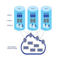
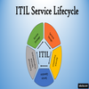

# 👋 Hi, I’m Galal

## One year bootcamp training at Intec Brussel.

---

- 🌱 I’m currently learner at **Intec** **Brussel** bootcamp campus as a junior network infrastructure.
- 💞️ I’m looking to collaborate on github
- 📫 How to reach me:[Linkedin](https://www.linkedin.com/in/galal-koro-1726891a9/) [my page](https://galalkoro98.github.io/galal-bio/)

---

- Just one small positive thought in the morning can change your whole day.
- Opportunities don't happen, you create them.
- Love your family, work super hard, live your passion.
- It is never too late to be what you might have been.

